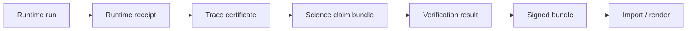

# pcs-core

**Proof-Carrying Science (PCS)** brings together schemas, validation, and tooling so research and agent workflows can publish **evidence that independent reviewers can verify**, including structured artifacts that go far beyond unstructured logs alone.

| | |
|---|---|
| **Version** | `0.1.0` ([tag `v0.1.0`](https://github.com/SentinelOps-CI/pcs-core/releases/tag/v0.1.0)) |
| **License** | [Apache-2.0](LICENSE) |
| **Docs** | [docs/README.md](docs/README.md) |
| **Release checklist** | [docs/releases/v0.1.0.md](docs/releases/v0.1.0.md) |

---

## Why this exists

Scientific and agent pipelines produce many JSON artifacts, including run receipts, certificates, claim bundles, verification results, and release manifests, and a shared contract keeps shapes, hashes, and validation aligned so integrations stay predictable across repositories.

**pcs-core** is the reference implementation of PCS v0.1 and offers a single schema set that every participating repository can import, a single validator where `pcs validate` applies JSON Schema together with semantic rules, a single hash rule that yields canonical `sha256:` digests across Python, Rust, and TypeScript, and golden examples that include both valid fixtures and intentionally invalid cases for continuous integration.

Participating projects include [LabTrust-Gym](https://github.com/fraware/LabTrust-Gym), [CertifyEdge](https://github.com/fraware/CertifyEdge), [Provability Fabric](https://github.com/SentinelOps-CI/provability-fabric), and [Scientific Memory](https://github.com/fraware/scientific-memory), and each of them imports artifact definitions from this repository so the ecosystem shares one authoritative schema source.

---

## How a release chain fits together

PCS ties each stage to hashes and provenance so reviewers can trace what was run, what attested the run, and what was verified before publication.



Canonical end-to-end fixtures for the LabTrust QC workflow live in [`examples/labtrust-release/`](examples/labtrust-release/), while tool-use safety and computation reproducibility maintain separate fixture trees under `examples/`.

---

## Try it in five minutes

The quick start assumes Python 3.11+ and Git.

```bash
git clone https://github.com/SentinelOps-CI/pcs-core.git
cd pcs-core
git checkout v0.1.0

cd python
pip install -e ".[dev]"

# Validate a real fixture
pcs validate ../examples/science_claim_bundle.certified.valid.json

# Canonical digest (same algorithm in all language bindings)
pcs hash ../examples/science_claim_bundle.certified.valid.json

# Check schemas and the full example corpus
pcs schema check
pcs examples check
```

A full release directory exercises thirty cross-artifact checks when you run the following command.

```bash
pcs validate-release-chain ../examples/labtrust-release/
```

The local release gate runs every check that maintainers expect before a pull request merges.

| Platform | Command |
|----------|---------|
| Linux / macOS / Git Bash | `bash scripts/run-release-verify.sh` |
| Windows | `powershell -File scripts/run-release-verify.ps1` |

Further orientation lives in [docs/README.md](docs/README.md).

---

## Documentation

| I want to… | Read |
|------------|------|
| Understand the protocol | [docs/protocol.md](docs/protocol.md) |
| Learn trust levels and labels | [docs/trust-model.md](docs/trust-model.md) |
| Integrate pcs-core in another repo | [docs/downstream-schema-sync.md](docs/downstream-schema-sync.md) |
| Work with release manifests and handoffs | [docs/release-protocol.md](docs/release-protocol.md) |
| Run or extend benchmarks | [docs/benchmarks.md](docs/benchmarks.md) |
| See every guide and policy doc | [docs/README.md](docs/README.md) |

---

## Command cheat sheet

| Command | What it does |
|---------|----------------|
| `pcs validate <file>` | Schema and semantic validation |
| `pcs hash <file>` | Canonical `sha256:` digest |
| `pcs validate-release-chain <dir>` | Consistency checks across a release tree |
| `pcs schema check` | Validates all JSON schemas in `schemas/` |
| `pcs examples check` | Exercises all valid fixtures and negative cases |
| `pcs conformance run --suite <name>` | Protocol test suite (`all`, `multidomain`, `benchmark-ingest`, …) |
| `pcs registry audit` | Lists semantic checks in the artifact registry |
| `pcs shared-hash-vectors verify` | Confirms Python, Rust, and TypeScript hash parity |

Run `pcs conformance run --suite all` to execute every suite, and read [conformance/README.md](conformance/README.md) for suite-by-suite notes.

---

## Repository map

```
pcs-core/
├── schemas/           # Normative JSON Schema (Draft 2020-12)
├── examples/          # Valid and invalid fixtures; release chains
├── benchmarks/        # Benchmark case trees (valid and invalid cases)
├── docs/              # Protocol, integration, and release guides
├── python/            # `pcs` CLI and pcs_core library
├── rust/              # Rust crate
├── typescript/        # @pcs/core package
├── conformance/       # Conformance suite documentation
└── test_vectors/hash/   # Cross-language hash test vectors
```

Core artifact types, including runs, certificates, claim bundles, release manifests, workflow profiles, and benchmarks, appear in [docs/protocol.md](docs/protocol.md) and [docs/release-protocol.md](docs/release-protocol.md).

---

## Workflows in v0.1

| Workflow | Example fixtures |
|----------|------------------|
| LabTrust QC release | [`examples/labtrust-release/`](examples/labtrust-release/) |
| Agent tool-use safety | [`examples/tool-use-release/`](examples/tool-use-release/) |
| Scientific computation reproducibility | [`examples/computation-release/`](examples/computation-release/) |

Benchmark producers publish standardized ingest bundles under [`examples/benchmark_ingest/`](examples/benchmark_ingest/), and the contract appears in [docs/benchmark-ingest-contract.md](docs/benchmark-ingest-contract.md).

---

## Contributing

We welcome issues, documentation improvements, fixtures, and code, and focused pull requests that touch one language binding or one topic area receive the fastest reviews.

**Good first steps**

1. Read [docs/protocol.md](docs/protocol.md) and [docs/trust-model.md](docs/trust-model.md) to learn shared vocabulary.
2. Clone the repository, install Python dependencies with `pip install -e python/.[dev]`, and run `pcs examples check` to confirm your environment.
3. Choose a contribution area such as documentation clarity, a new negative fixture, conformance coverage, or clearer validator messages.
4. Run `bash scripts/run-release-verify.sh` on Linux or macOS, or the PowerShell script on Windows, before you open a pull request.

**Ways to help**

| Area | Ideas |
|------|--------|
| Documentation | Clarify confusing sections, add diagrams, and strengthen examples |
| Examples | Add minimal valid or invalid JSON that exercises one rule |
| Python | Extend validation rules, improve CLI feedback, and expand `python/tests/` |
| Rust / TypeScript | Maintain parity with Python hashing and artifact detection |
| Benchmarks | Add cases under `benchmarks/` with explicit expected outcomes |

**Pull requests**

Keep each change scoped and link related documentation whenever behavior shifts. Regenerate goldens under `examples/benchmark_ingest/` with `pcs benchmark materialize-ingest` because hand edits break continuous integration checks described in [examples/benchmark_ingest/README.md](examples/benchmark_ingest/README.md). Ensure `pcs schema check` and `pcs examples check` pass, and run the release verify script when you modify schemas, fixtures, or validators.

Open a [GitHub issue](https://github.com/SentinelOps-CI/pcs-core/issues) for questions or design discussion. Release tagging steps appear in [docs/releases/v0.1.0.md](docs/releases/v0.1.0.md).

---

## Using pcs-core in your project

Pin this repository at tag **`v0.1.0`** through a submodule, a vendor copy, or a package install from `python/`. Validate every artifact with `pcs validate` before publication or import. Compute digests with `pcs hash` using the canonical algorithm documented in [docs/hash-canonicalization.md](docs/hash-canonicalization.md). Mirror `schemas/` and fail continuous integration when the mirror drifts from the pinned revision, following [docs/downstream-schema-sync.md](docs/downstream-schema-sync.md). Run the conformance suites that match your workflow, for example `pcs conformance run --suite <name>`.

---

## License

Apache-2.0. See [LICENSE](LICENSE).
