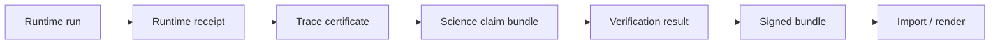

# pcs-core

**Proof-Carrying Science (PCS)** — schemas, validation, and tooling so research and agent workflows can ship **evidence you can verify**, not just logs.

| | |
|---|---|
| **Version** | `0.1.0` ([tag `v0.1.0`](https://github.com/SentinelOps-CI/pcs-core/releases/tag/v0.1.0)) |
| **License** | [Apache-2.0](LICENSE) |
| **Docs** | [docs/README.md](docs/README.md) |
| **Release checklist** | [docs/releases/v0.1.0.md](docs/releases/v0.1.0.md) |

---

## Why this exists

Scientific and agent pipelines produce many JSON artifacts: run receipts, certificates, claim bundles, verification results, and release manifests. Without a shared contract, every team reinvents shapes, hashes, and validation — and integrations break silently.

**pcs-core** is the reference implementation of PCS v0.1:

- **One schema set** — JSON Schema definitions every participating repo can import.
- **One validator** — `pcs validate` checks structure and semantic rules (not only JSON Schema).
- **One hash rule** — canonical `sha256:` digests that match across Python, Rust, and TypeScript.
- **Golden examples** — valid and intentionally invalid fixtures you can test against in CI.

Participating projects include [LabTrust-Gym](https://github.com/fraware/LabTrust-Gym), [CertifyEdge](https://github.com/fraware/CertifyEdge), [Provability Fabric](https://github.com/SentinelOps-CI/provability-fabric), and [Scientific Memory](https://github.com/fraware/scientific-memory). They consume artifacts from here; they do not fork schema definitions.

---

## How a release chain fits together

PCS ties each stage to hashes and provenance so you can answer: *what was run, what attested it, and what was verified before publish?*



Canonical end-to-end fixtures for the LabTrust QC workflow live in [`examples/labtrust-release/`](examples/labtrust-release/). Other workflows (tool-use safety, computation reproducibility) have their own fixture trees under `examples/`.

---

## Try it in five minutes

**Requirements:** Python 3.11+, Git.

```bash
git clone https://github.com/SentinelOps-CI/pcs-core.git
cd pcs-core
git checkout v0.1.0

cd python
pip install -e ".[dev]"

# Validate a real fixture
pcs validate ../examples/science_claim_bundle.certified.valid.json

# Canonical digest (same algorithm in all language bindings)
pcs hash ../examples/science_claim_bundle.certified.valid.json

# Check schemas and the full example corpus
pcs schema check
pcs examples check
```

Validate a full release directory (30 cross-artifact checks):

```bash
pcs validate-release-chain ../examples/labtrust-release/
```

Run the full local release gate (recommended before opening a PR):

| Platform | Command |
|----------|---------|
| Linux / macOS / Git Bash | `bash scripts/run-release-verify.sh` |
| Windows | `powershell -File scripts/run-release-verify.ps1` |

Details: [docs/README.md](docs/README.md).

---

## Documentation

| I want to… | Read |
|------------|------|
| Understand the protocol | [docs/protocol.md](docs/protocol.md) |
| Learn trust levels and labels | [docs/trust-model.md](docs/trust-model.md) |
| Integrate pcs-core in another repo | [docs/downstream-schema-sync.md](docs/downstream-schema-sync.md) |
| Work with release manifests and handoffs | [docs/release-protocol.md](docs/release-protocol.md) |
| Run or extend benchmarks | [docs/benchmarks.md](docs/benchmarks.md) |
| See every guide and policy doc | [docs/README.md](docs/README.md) |

---

## Command cheat sheet

| Command | What it does |
|---------|----------------|
| `pcs validate <file>` | Schema + semantic validation |
| `pcs hash <file>` | Canonical `sha256:` digest |
| `pcs validate-release-chain <dir>` | Consistency checks across a release tree |
| `pcs schema check` | Validate all JSON schemas in `schemas/` |
| `pcs examples check` | All `*.valid.json` / negative fixtures |
| `pcs conformance run --suite <name>` | Protocol test suite (`all`, `multidomain`, `benchmark-ingest`, …) |
| `pcs registry audit` | List semantic checks in the artifact registry |
| `pcs shared-hash-vectors verify` | Python / Rust / TypeScript hash parity |

List suites: `pcs conformance run --suite all`. Suite notes: [conformance/README.md](conformance/README.md).

---

## Repository map

```
pcs-core/
├── schemas/           # Normative JSON Schema (Draft 2020-12)
├── examples/          # Valid + invalid fixtures; release chains
├── benchmarks/        # Benchmark case trees (valid / invalid cases)
├── docs/              # Protocol, integration, and release guides
├── python/            # `pcs` CLI and pcs_core library
├── rust/              # Rust crate
├── typescript/        # @pcs/core package
├── conformance/       # Conformance suite documentation
└── test_vectors/hash/   # Cross-language hash test vectors
```

Core artifact types (runs, certificates, claim bundles, release manifests, workflow profiles, benchmarks) are listed in [docs/protocol.md](docs/protocol.md) and [docs/release-protocol.md](docs/release-protocol.md).

---

## Workflows in v0.1

| Workflow | Example fixtures |
|----------|------------------|
| LabTrust QC release | [`examples/labtrust-release/`](examples/labtrust-release/) |
| Agent tool-use safety | [`examples/tool-use-release/`](examples/tool-use-release/) |
| Scientific computation reproducibility | [`examples/computation-release/`](examples/computation-release/) |

Benchmark producers publish standardized ingest bundles under [`examples/benchmark_ingest/`](examples/benchmark_ingest/). See [docs/benchmark-ingest-contract.md](docs/benchmark-ingest-contract.md).

---

## Contributing

We welcome issues, docs improvements, fixtures, and code. You do not need to touch every language binding — focused PRs are easier to review.

**Good first steps**

1. Read [docs/protocol.md](docs/protocol.md) and [docs/trust-model.md](docs/trust-model.md) for vocabulary.
2. Clone the repo, install Python deps (`pip install -e python/.[dev]`), run `pcs examples check`.
3. Pick an area: docs clarity, a new negative fixture, conformance coverage, or validator messages.
4. Run `bash scripts/run-release-verify.sh` (or the PowerShell script on Windows) before you open a PR.

**Ways to help**

| Area | Ideas |
|------|--------|
| Documentation | Fix confusing sections, add diagrams, improve examples |
| Examples | Add minimal valid/invalid JSON that tests one rule |
| Python | Validation rules, CLI UX, tests in `python/tests/` |
| Rust / TypeScript | Parity with Python hashing and detection logic |
| Benchmarks | New cases under `benchmarks/` with clear expected outcomes |

**Pull requests**

- Keep changes scoped; link related docs when you change behavior.
- Do not hand-edit generated goldens under `examples/benchmark_ingest/` — use `pcs benchmark materialize-ingest` (see [examples/benchmark_ingest/README.md](examples/benchmark_ingest/README.md)).
- Ensure `pcs schema check` and `pcs examples check` pass; run the release verify script when you touch schemas, fixtures, or validators.

Questions or design discussion: open a [GitHub issue](https://github.com/SentinelOps-CI/pcs-core/issues). For release tagging and checklist steps, see [docs/releases/v0.1.0.md](docs/releases/v0.1.0.md).

---

## Using pcs-core in your project

1. Pin this repository at tag **`v0.1.0`** (submodule, vendor copy, or package install from `python/`).
2. Validate every artifact with `pcs validate` before publish or downstream import.
3. Use `pcs hash` for digests — do not reimplement canonicalization ([docs/hash-canonicalization.md](docs/hash-canonicalization.md)).
4. Mirror `schemas/` and fail CI when they drift ([docs/downstream-schema-sync.md](docs/downstream-schema-sync.md)).
5. Run relevant conformance suites in your pipeline: `pcs conformance run --suite <name>`.

---

## License

Apache-2.0. See [LICENSE](LICENSE).
