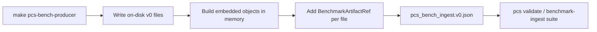

# Producer benchmark ingest

CertifyEdge, LabTrust-Gym, Provability Fabric, and Scientific Memory export `PcsBenchIngest.v0` for the benchmark runner and for pcs-core continuous integration, and the contract is defined in [benchmark-ingest-contract.md](benchmark-ingest-contract.md).

## Contract summary

| Layer | Rule |
|-------|------|
| Arrays (`benchmark_runs`, `coverage_reports`, …) | Full v0 JSON objects for release-grade bundles |
| `artifact_refs` | Sidecar provenance with paths and content digests that supplement embedded objects |
| `signature_or_digest` | Canonical hash per pcs-core rules on each artifact and on the ingest root |
| `source_repo` / `source_commit` | Required on ingest and sub-artifacts with real 40-character SHAs at release-grade |

## Required producer target

Every producer repository exposes a `pcs-bench-producer` make target that runs the benchmark, writes `pcs_bench_ingest.v0.json`, and validates the export against pcs-core and the benchmark runner.

| Producer | Export path (repo-relative) |
|----------|----------------------------|
| LabTrust-Gym | `benchmark_runs/labtrust_reproducibility/pcs_bench_ingest.v0.json` |
| CertifyEdge | `benchmark_runs/tool_use_safety/pcs_bench_ingest.v0.json` |
| provability-fabric | `benchmark_runs/labtrust_admission/pcs_bench_ingest.v0.json` |
| scientific-memory | `benchmark_runs/labtrust_rendering/pcs_bench_ingest.v0.json` |

Release-grade exports pass `pcs validate` on the ingest file and `pcs-bench validate-ingest` in producer continuous integration.

## Recommended export flow



Run `make pcs-bench-producer` and write canonical v0 files under a stable directory, load or generate the same content as in-memory v0 objects in the ingest arrays, compute `signature_or_digest` for each object using pcs-core `canonical_hash`, append `artifact_refs` with repo-relative `path`, `sha256` equal to that object digest, `role` set to `producer_export`, and producer `source_repo` together with `source_commit`, then hash the ingest body into `PcsBenchIngest.signature_or_digest`.

## pcs-core golden sync

With producer repositories checked out as siblings of pcs-core, or with `PCS_PRODUCER_REPOS_ROOT` pointing at their parent directory, run `make pcs-bench-producer` in each producer repository, then run the pcs-core commands below.

```bash
cd python
python scripts/materialize_benchmark_producer_examples.py
python ../scripts/validate_benchmark_ingest_examples.py --release-grade
pcs conformance run --suite benchmark-ingest
```

Materialize copies sibling exports into `examples/benchmark_ingest/*.pcs_bench_ingest.valid.json` when the export is present and release-grade, and when validation fails pcs-core keeps the existing golden while printing `skip live ingest` so the dialect fallback remains authoritative until the producer export conforms.

## Dialect fallback for continuous integration without siblings

Representative upstream JSON is captured as `examples/benchmarks/compatibility/<producer>_<feature>.dialect.json`, and normalizers in `pcs_core.benchmark_compat` map dialect JSON to `PcsBenchIngest.v0`.

| Producer | Python entrypoint | Release-grade arrays |
|----------|-------------------|----------------------|
| `certifyedge` | `build_certifyedge_pcs_bench_ingest` | `coverage_reports`, `profile_coverage_reports` |
| `labtrust-gym` | `build_labtrust_pcs_bench_ingest` | `benchmark_runs`, `coverage_reports` |
| `provability-fabric` | `build_pf_pcs_bench_ingest` | `failure_localization_reports`, `explain_quality_reports`, `profile_coverage_reports` |
| `scientific-memory` | `build_scientific_memory_pcs_bench_ingest` | `explain_quality_reports`, `coverage_reports` |

```bash
pcs benchmark normalize \
  --dialect examples/benchmarks/compatibility/scientific_memory_render_benchmark.dialect.json \
  --out /tmp/scientific_memory.pcs_bench_ingest.json
```

## Pinning pcs-core

Pin a submodule or package to a full git SHA of [pcs-core](https://github.com/SentinelOps-CI/pcs-core), run `pcs conformance run --suite benchmark-ingest` in producer continuous integration after generating ingest JSON, and set ingest `source_commit` to the producer repository SHA that produced the export.

## Recommended practices

| Practice | Outcome |
|----------|---------|
| Embed full v0 objects in ingest arrays | Valid release-grade ingest that aggregators can consume directly |
| Add `artifact_refs` with matching `sha256` when exporting files | Audit-ready provenance that links on-disk exports to embedded digests |
| Regenerate pcs-core goldens through materialize | Stable continuous integration without hand-edited drift |
| Pin real 40-character git SHAs in release publishes | Reproducible evidence that reviewers can replay |
| Normalize dialect JSON before validation | Smooth upgrades when upstream shapes still reflect legacy dialects |

## Benchmark runner consumption

The benchmark runner validates each producer ingest, reads embedded arrays first, aggregates metrics into `BenchmarkReport.v0` with `metric_summaries`, and executes suite cases under `benchmarks/` in pcs-core.

## Dialect compatibility

pcs-core owns benchmark JSON schemas, producer repositories may keep internal dialect JSON, and continuous integration verifies that each dialect normalizes to v0.

| Producer ID | Typical input | Normalizer |
|-------------|---------------|------------|
| `pcs-core` | Native fixtures under `benchmarks/` | Native |
| `pcs-bench` | Suite reports | `normalize_pcs_bench_report` |
| `certifyedge` | Certificate benchmark | `build_certifyedge_pcs_bench_ingest` |
| `labtrust-gym` | Case manifests | `normalize_labtrust_case_manifest` |
| `scientific-memory` | Render and import audit | `build_scientific_memory_pcs_bench_ingest` |
| `provability-fabric` | Admission and profile | `build_pf_pcs_bench_ingest` |

The compatibility corpus lives under `examples/benchmarks/compatibility/*.dialect.json` and `*.normalized.json`, and `validate_compatibility_corpus()` together with the `benchmark-ingest` and `benchmark-report` conformance suites exercise it.

Metric definitions appear in `examples/benchmark_metric_registry.valid.json` as described in [benchmark-metrics.md](benchmark-metrics.md).
