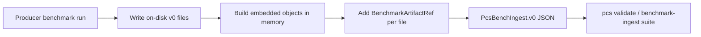

# Producer integration: PcsBenchIngest.v0

Guide for **CertifyEdge**, **LabTrust-Gym**, **Provability Fabric**, and **Scientific Memory** to emit pcs-bench-compatible benchmark exports without forking schemas.

## Contract summary

| Layer | Rule |
|-------|------|
| Arrays (`benchmark_runs`, `coverage_reports`, …) | **Full v0 JSON objects** (release-grade) |
| `artifact_refs` | **Optional provenance only** — paths + content digests; never a substitute for embedded objects |
| `signature_or_digest` | Canonical hash per pcs-core rules on each artifact and on the ingest root |

Normative spec: [benchmark-ingest-contract.md](benchmark-ingest-contract.md).

## Recommended export flow



1. Run the repo’s benchmark command and write canonical v0 files under a stable directory (e.g. `benchmarks/rendering/…`).
2. Load or generate the same content as in-memory v0 objects.
3. Compute `signature_or_digest` for each object (or use pcs-core `canonical_hash`).
4. Append `artifact_refs` with `path` (repo-relative), `sha256` equal to that object’s digest, `role: producer_export`, and producer `source_repo` / `source_commit`.
5. Assemble `PcsBenchIngest.v0` and hash the ingest body.

## Dialect-first CI in pcs-core

Capture a **representative** upstream JSON file as:

`examples/benchmarks/compatibility/<producer>_<feature>.dialect.json`

pcs-core materializes goldens:

```bash
cd pcs-core/python
python scripts/materialize_benchmark_producer_examples.py
```

Outputs:

- `examples/benchmark_ingest/<producer>.pcs_bench_ingest.valid.json`
- Updated `examples/benchmarks/compatibility/*.pcs_bench_ingest.normalized.json`

Downstream repos should run an equivalent normalizer in their CI and diff against pcs-core goldens when upgrading pins.

## Normalizers (pcs-core)

| Producer | Python entrypoint | Embedded slot |
|----------|-----------------|---------------|
| `certifyedge` | `build_certifyedge_pcs_bench_ingest` | `coverage_reports` |
| `labtrust-gym` | `build_labtrust_pcs_bench_ingest` | `benchmark_runs` |
| `provability-fabric` | `build_pf_pcs_bench_ingest` | `explain_quality_reports`, `profile_coverage_reports` |
| `scientific-memory` | `build_scientific_memory_pcs_bench_ingest` | `explain_quality_reports` |

CLI:

```bash
pcs benchmark normalize \
  --dialect examples/benchmarks/compatibility/scientific_memory_render_benchmark.dialect.json \
  --out /tmp/scientific_memory.pcs_bench_ingest.json
```

Dialect filenames listed in `pcs_core.benchmark_compat.INGEST_NORMALIZERS` normalize to **`PcsBenchIngest.v0`**.

## Pinning pcs-core

1. Submodule or package pin to a **full git SHA**.
2. `pcs conformance run --suite benchmark-ingest` in producer CI (after copying or generating ingest JSON).
3. Record `source_commit` on the ingest as the producer repo SHA that produced the export.

## Anti-patterns

| Do not | Do instead |
|--------|------------|
| Emit only file paths in `benchmark_runs` / `coverage_reports` arrays | Embed objects; use `artifact_refs` for paths |
| Omit `artifact_refs` when exporting files | One ref per embedded object with matching `sha256` |
| Hand-edit `examples/benchmark_ingest/*.json` in pcs-core | Regenerate from dialect or live gallery |
| Use placeholder `source_commit` in release publishes | Pin 40-character git SHAs |

## pcs-bench consumption

pcs-bench imports `BenchmarkRegistry.v0` / `BenchmarkMetricRegistry.v0`, validates each producer ingest, aggregates metrics into `BenchmarkReport.v0` with `metric_summaries`, and runs suite cases under `benchmarks/` in pcs-core.
